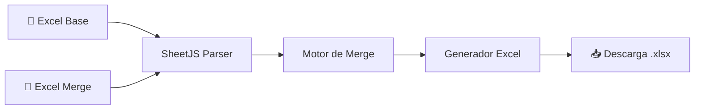
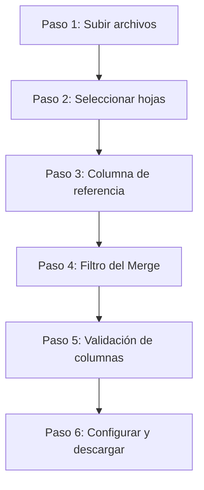

# Excel Merge Tool — Plan de Implementación

Aplicación web estática (HTML + CSS + JavaScript vanilla) deployable en GitHub Pages que permite hacer merge de dos archivos Excel seleccionando hojas, columna de referencia, y descargando el resultado **en un sheet nuevo** dentro del Excel Base, sin modificar las hojas originales. Las columnas nuevas se resaltan con color parametrizable.

## Arquitectura General



**Stack tecnológico:**
- HTML5 + CSS3 + JavaScript vanilla (ES6+)
- [SheetJS (xlsx)](https://cdn.sheetjs.com/xlsx-0.20.3/package/dist/xlsx.full.min.js) — lectura/escritura de Excel (CDN, sin npm)
- Sin backend — todo se procesa en el navegador del cliente

---

## Flujo de la Aplicación (Wizard por pasos)

La UI será un wizard progresivo de **6 pasos**. Cada paso se desbloquea al completar el anterior.



### Paso 1 — Subir Archivos
- Dos zonas de drag & drop (o botones de carga)
- **Excel Base**: el archivo que recibirá los cambios
- **Excel Merge**: el archivo de donde se toman los cambios
- Se valida que sean archivos `.xlsx` / `.xls`
- Al subir ambos, se habilita el Paso 2

### Paso 2 — Seleccionar Hojas
- Para cada archivo se muestra una **interfaz visual con los nombres de todas las hojas** detectadas (tarjetas o lista clicable)
- El usuario ve claramente qué hojas tiene cada Excel y selecciona una de cada uno
- Pueden ser hojas diferentes (distinto nombre/índice)
- Al seleccionar ambas hojas, se dispara automáticamente la **detección de cabeceras** y se habilita el Paso 3

### Paso 3 — Columna de Referencia
- Se muestran las **columnas detectadas en cada hoja** en dos paneles lado a lado:
  - Panel izquierdo: columnas de la hoja del Base
  - Panel derecho: columnas de la hoja del Merge
- La columna de referencia se selecciona de un **dropdown** que lista las columnas de la hoja Base (no se escribe manualmente)
- Al seleccionar una columna, se valida que **exista con el mismo nombre exacto** en la hoja del Merge
  - ✅ Si existe → se habilita el Paso 4
  - ❌ Si no existe → se muestra error indicando que la columna de referencia debe existir en ambas hojas

### Paso 4 — Filtro del Merge (opcional)
Permite filtrar las filas del Excel Merge **antes** de ejecutar el merge, para que solo las filas que cumplan el filtro participen en el proceso.

- **Columna de filtro**: dropdown con las columnas de la hoja del Merge (puede ser cualquier columna, no solo la de referencia)
- **Valor de filtro**: al seleccionar la columna, se extraen automáticamente los **valores únicos** de esa columna y se muestran en un dropdown para que el usuario seleccione uno
- **Preview**: se muestra cuántas filas del Merge cumplen el filtro vs. el total (ej: `"23 de 150 filas pasarán al merge"`)
- **Botón "Omitir filtro"**: el paso es opcional — si el usuario no quiere filtrar, puede saltar al Paso 5 directamente y se usarán todas las filas del Merge
- Al confirmar el filtro (o saltar), se habilita el Paso 5

### Paso 5 — Validación de Columnas
Antes de ejecutar el merge, se muestra un **resumen comparativo** de las columnas:

| Categoría | Descripción | Indicador visual |
|-----------|-------------|-------------------|
| **Columnas en común** | Existen en ambas hojas (se hará merge) | ✅ Verde |
| **Solo en Base** | Existen solo en el Base (se mantienen tal cual) | 🟡 Amarillo |
| **Solo en Merge** | Existen solo en el Merge (se agregarán como nuevas) | 🟠 Naranja |

- La tabla muestra cada columna con su categoría y color
- El usuario puede ver exactamente qué columnas se agregarán antes de ejecutar
- Botón **"Continuar al Merge"** para confirmar y pasar al Paso 6

### Paso 6 — Configurar Merge y Descargar
- **Nombre del sheet de resultado**: input de texto con valor por defecto `"Merge_Result"`
- **Color de columnas nuevas**: input de tipo `color` con valor por defecto `#FFA500` (naranja)
- **Color de filas sin correspondencia**: input de tipo `color` con valor por defecto `#FFCCCC` (rojo suave)
- Botón **"Ejecutar Merge"**
- Al completar el merge:
  - Tabla preview del resultado (primeras 50 filas)
  - Estadísticas: filas mergeadas, columnas nuevas, filas sin match, filas filtradas
  - Botón **"Descargar Excel Mergeado"** → genera y descarga `.xlsx`

---

## Lógica del Motor de Merge

> **IMPORTANTE:**
> **El merge NO modifica las hojas existentes del Excel Base.** El resultado se escribe en un **sheet nuevo** cuyo nombre define el usuario (por defecto `"Merge_Result"`). El archivo descargado contiene todas las hojas originales del Base + el sheet nuevo con el resultado del merge.

### 1.6 — Detección automática de cabeceras

> **IMPORTANTE:**
> La posición de la cabecera puede variar entre archivos. La app NO asume que la fila 1 es la cabecera.

**Algoritmo de detección (se ejecuta al seleccionar hojas en el Paso 2):**
1. Se escanea la hoja celda por celda (fila por fila, columna por columna)
2. Se busca la primera fila que tenga múltiples celdas con texto (heurística: fila con ≥2 celdas no vacías consecutivas)
3. Esa fila se define como la **fila de cabecera candidata**
4. Se leen todas las celdas de esa fila para obtener los nombres de columnas
5. Estos nombres se usan para poblar el **dropdown de columna de referencia** en el Paso 3 y la **tabla de validación** en el Paso 4

Esto se hace en ambos archivos independientemente — cada uno puede tener su cabecera en filas distintas.

### Merge de datos

```
0. Si hay filtro activo (Paso 4), aplicar el filtro al Excel Merge:
   - Conservar solo las filas donde la columna de filtro == valor seleccionado
   - Las filas filtradas NO participan en el merge
1. Copiar TODAS las filas del Base al sheet de resultado (mantener orden original)
2. Para cada fila del resultado (que vino del Base):
   a. Buscar en el Excel Merge (filtrado) una fila con el mismo valor en la columna de referencia
   b. Si hay match:
      - Sobreescribir los valores de las columnas que coinciden con los del Merge
      - Para columnas del Merge que NO existan en el Base → agregar como columna nueva
3. Para cada fila del Merge (filtrado) que NO tuvo match con ninguna fila del Base:
   - Agregar la fila completa al FINAL del resultado
   - Colorear toda la fila con el color de "sin correspondencia" (parametrizable)
```

> **NOTA:**
> **El orden de las filas del Base se mantiene siempre.** Las filas del Merge que no tienen match se agregan al final, después de todas las filas originales del Base.

### 1.4 — Columnas nuevas

- Las columnas del Merge que no existan en el Base se agregan **al final** (última columna + 1, +2, etc.) dentro del **sheet nuevo de resultado**
- En el Excel de salida, las celdas de esas columnas nuevas se colorean con el color parametrizado (por defecto naranja `#FFA500`)
- El color se aplica como fondo de celda en el `.xlsx` generado

### Filas sin correspondencia

- Las filas del Merge que no tienen match en el Base se agregan al final del sheet de resultado
- Se colorean con un **color parametrizable** (por defecto rojo suave `#FFCCCC`), distinto al de columnas nuevas
- El usuario puede cambiar este color en el Paso 6 de configuración

---

## Estructura de Archivos

```
excelProyect/
├── index.html          ← Página principal con el wizard
├── css/
│   └── styles.css      ← Estilos de la aplicación
├── js/
│   ├── app.js          ← Controlador principal / wizard flow
│   ├── excelParser.js  ← Lectura de Excel y detección de cabeceras
│   ├── mergeEngine.js  ← Lógica de merge
│   └── excelWriter.js  ← Generación del Excel de salida
├── PLAN.md             ← Este documento
└── README.md           ← Documentación del proyecto
```

> **NOTA:**
> SheetJS se carga desde CDN (`https://cdn.sheetjs.com/xlsx-0.20.3/package/dist/xlsx.full.min.js`), no se necesita `npm install`.

---

## Propuesta de Diseño Visual

- **Tema oscuro** con acentos en gradiente azul-púrpura
- **Glassmorphism** en las tarjetas de cada paso del wizard
- **Progress bar animada** conectando los pasos
- **Drag & drop** con animación de hover y feedback visual
- **Micro-animaciones** en transiciones entre pasos
- **Tipografía**: Google Fonts — Inter para UI, JetBrains Mono para datos de tabla
- **Responsive**: funciona en desktop y tablet

---

## Archivos a Crear

### index.html
Página principal con:
- Meta tags SEO
- Carga de SheetJS desde CDN
- Google Fonts (Inter, JetBrains Mono)
- Estructura del wizard de 6 pasos
- Zonas de drag & drop
- Selectores de hojas, inputs de configuración
- Tabla de preview y botón de descarga

### css/styles.css
Design system completo:
- Variables CSS (colores, spacing, typography)
- Tema oscuro con glassmorphism
- Componentes: wizard steps, cards, dropzone, buttons, selects, table
- Animaciones y transiciones
- Responsive breakpoints

### js/excelParser.js
- `parseExcelFile(file)` → retorna workbook con nombres de hojas
- `detectHeader(sheet)` → escanea la hoja para encontrar la fila de cabecera automáticamente, retorna `{ headerRow, columns: string[] }`
- `extractData(sheet, headerRow, columns)` → retorna array de objetos `[{ colName: value, ... }]`
- `compareColumns(baseColumns, mergeColumns)` → retorna `{ common[], onlyBase[], onlyMerge[] }` para la tabla de validación del Paso 5
- `getUniqueValues(data, columnName)` → retorna valores únicos de una columna para poblar el dropdown de filtro del Paso 4
- `filterData(data, columnName, value)` → retorna las filas que cumplen el filtro

### js/mergeEngine.js
- `performMerge(baseData, mergeData, referenceColumn, filter?)` → retorna `{ mergedData, newColumns[], stats }`
- Si se pasa filtro, primero filtra `mergeData` antes de procesar
- Maneja: match exacto, filas sin match, columnas nuevas
- Retorna estadísticas del merge (filas actualizadas, agregadas, columnas nuevas, filas filtradas)

### js/excelWriter.js
- `generateExcel(baseWorkbook, mergedData, newColumns, highlightColor, newSheetName)` → genera y descarga `.xlsx`
- **Preserva todas las hojas originales del Excel Base** sin modificarlas
- Crea un **sheet nuevo** con el nombre indicado por el usuario (por defecto `"Merge_Result"`) y escribe ahí los datos mergeados
- Aplica color de fondo a celdas de columnas nuevas usando SheetJS styles
- Si ya existe un sheet con el mismo nombre, le agrega un sufijo numérico (`Merge_Result_2`, etc.)

### js/app.js
- Controlador del wizard (navegación entre pasos)
- Event listeners para drag & drop y carga de archivos
- Orquesta la secuencia: parse → select sheet → detect columns → filter → validate → merge → preview → download
- Manejo del paso de filtro opcional (skip/apply)
- Manejo de errores con mensajes al usuario

### README.md
- Descripción del proyecto
- Instrucciones de uso
- Cómo deployar en GitHub Pages

---

## Decisiones Confirmadas

- ✅ **Filas sin match** → se agregan al final del resultado, coloreadas con color parametrizable
- ✅ **Sobreescritura** → los valores del Merge siempre sobreescriben los del Base, manteniendo el orden de filas del Base
- ✅ **Formato** → no se preserva el formato original del Base; solo se aplican colores parametrizables para columnas nuevas y filas sin correspondencia
- ✅ **Sheet de resultado** → el merge se escribe en un sheet nuevo, sin modificar las hojas existentes del Base

---

## Verificación

1. Abrir `index.html` en el navegador (o con Live Server)
2. Subir dos archivos Excel de prueba con:
   - Cabeceras en filas distintas (ej: Base en fila 3, Merge en fila 1)
   - Algunas columnas en común y algunas solo en el Merge
   - Valores de referencia que hagan match y otros que no
3. Verificar que:
   - Las hojas se listan correctamente con interfaz visual
   - Las columnas se detectan y muestran en paneles lado a lado
   - La columna de referencia se valida en ambas hojas
   - El filtro del Merge muestra valores únicos correctamente
   - El filtro reduce las filas del Merge y muestra el conteo
   - Omitir el filtro funciona correctamente (usa todas las filas)
   - La tabla de validación muestra correctamente las 3 categorías de columnas
   - El merge produce el resultado esperado (con y sin filtro)
   - El orden de las filas del Base se preserva en el resultado
   - Las columnas nuevas aparecen al final con color naranja
   - Las filas sin match aparecen al final con color rojo suave
   - El archivo descargado contiene todas las hojas originales + el sheet nuevo
   - El archivo se abre correctamente en Excel/LibreOffice
4. Probar en GitHub Pages desplegando con `git push`
